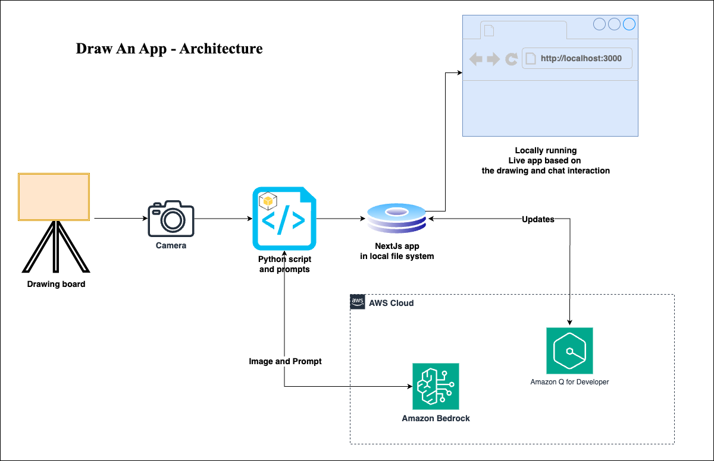

# Draw-an-App - Sketch to Reality

This project uses AWS Bedrock's Claude 3 Sonnet model to convert hand-drawn UI sketches into working web applications. It supports two modes of operation:
1. Real-time webcam capture for immediate sketching and conversion
2. Image upload through a user-friendly Streamlit interface

## Prerequisites

### Node.js Setup
- Node.js 18.x or higher
  
#### Windows Installation
1. Download the Node.js installer from [official website](https://nodejs.org/)
2. Run the installer (.msi file)
3. Follow the installation wizard
4. Verify installation:
```cmd
node --version
npm --version
```

#### macOS/Linux Installation
Using package manager:
```bash
# For macOS (using Homebrew)
brew install node

# For Ubuntu/Debian
curl -fsSL https://deb.nodesource.com/setup_18.x | sudo -E bash -
sudo apt-get install -y nodejs

# For other Linux distributions, check your package manager
```

### Python Setup
- Python 3.8 or higher
- Webcam (for webcam-based flow)
- AWS Account with Bedrock access
- Access to Claude 3 Sonnet model in AWS Bedrock
- Git

#### Windows Installation
1. Download Python installer from [python.org](https://www.python.org/downloads/)
2. Run the installer
3. **Important**: Check "Add Python to PATH" during installation
4. Verify installation:
```cmd
python --version
pip --version
```

#### macOS/Linux Installation
```bash
# macOS (using Homebrew)
brew install python

# Ubuntu/Debian
sudo apt-get update
sudo apt-get install python3 python3-pip

# Verify installation
python3 --version
pip3 --version
```

## Architecture



The system follows this flow:

1. **Image Input**: The application supports two methods:
   - OpenCV webcam capture for real-time sketching
   - Streamlit-based image upload interface

2. **Image Processing**: The captured/uploaded image is processed and converted to a format suitable for analysis.

3. **Claude 3 Integration**: The processed image is sent to AWS Bedrock's Claude 3 Sonnet model along with carefully crafted prompts that guide the model to:
   - Analyze and understand the UI elements in the sketch
   - Generate appropriate Next.js components and code
   - Ensure the generated code follows best practices

4. **Code Generation**: Claude 3 generates the necessary Next.js components, styles, and functionality based on the sketch.

5. **Application Update**: The system automatically:
   - Updates the Next.js application files
   - Applies any necessary styling
   - Implements required functionality
   - Hot-reloads the development server

6. **Live Preview**: The changes are immediately visible in the running Next.js application, providing instant feedback on the generated code.

7. **Future Updates**: The developers can use the Amazon Q for Developer for future updates to the generated code.

## Environment Setup

1. Clone the repository:
```bash
git clone <repository-url>
cd draw-an-app
```

2. Create and activate a virtual environment:

Windows:
```cmd
python -m venv venv
.\venv\Scripts\activate
```

macOS/Linux:
```bash
python3 -m venv venv
source venv/bin/activate
```

3. Install required Python packages:

Windows:
```cmd
pip install -r src\requirements.txt
```

macOS/Linux:
```bash
pip install -r src/requirements.txt
```

4. Install Node.js dependencies:

Windows/macOS/Linux:
```bash
cd blank-nextjs-app
npm install
cd ..
```

## AWS Bedrock Configuration

1. Configure AWS credentials:

Windows (PowerShell):
```powershell
$env:AWS_ACCESS_KEY_ID="your_access_key"
$env:AWS_SECRET_ACCESS_KEY="your_secret_key"
$env:AWS_DEFAULT_REGION="us-west-2"  # or your preferred region
```

macOS/Linux:
```bash
export AWS_ACCESS_KEY_ID=your_access_key
export AWS_SECRET_ACCESS_KEY=your_secret_key
export AWS_DEFAULT_REGION=us-west-2  # or your preferred region
```

Alternatively, you can configure AWS credentials using the AWS CLI:
```bash
aws configure
```

2. Verify Bedrock Access:
- Ensure you have access to the Claude 3 Sonnet model in AWS Bedrock
- Verify your AWS account has the necessary permissions to invoke the Bedrock runtime

## System Check

Before running the application, verify:

1. Your webcam is properly connected and accessible (if using webcam flow)
2. You have access to AWS Bedrock's Claude 3 Sonnet model
3. AWS credentials are properly configured

## Usage

### Method 1: Webcam-based Flow

1. Start the Next.js development server:

Windows/macOS/Linux:
```bash
cd blank-nextjs-app
npm install
npm run dev
```
Keep this server running to view your generated applications at http://localhost:3000

2. In a new terminal, run the webcam-based application:

Windows:
```cmd
# Make sure you're in the project root directory and venv is activated
python src\main_v2.py
```

macOS/Linux:
```bash
# Make sure you're in the project root directory and venv is activated
python src/main_v2.py
```

3. When the webcam window opens:
   - Press SPACE to capture and process an image
   - Press Q to quit the application

### Method 2: Streamlit Interface

1. Start the Next.js development server (if not already running):
```bash
cd blank-nextjs-app
npm install
npm run dev
```

2. In a new terminal, launch the Streamlit interface:

Windows:
```cmd
# Make sure you're in the project root directory and venv is activated
streamlit run src\main_streamlit.py
```

macOS/Linux:
```bash
# Make sure you're in the project root directory and venv is activated
streamlit run src/main_streamlit.py
```

3. Using the Streamlit interface:
   - Upload your UI sketch image (supported formats: JPG, JPEG)
   - Click "Generate App" to process the image
   - The interface will show both original and processed images
   - Progress indicators will keep you informed of the generation process
   - View the generated application at http://localhost:3000

## Project Structure

```
draw-an-app/
├── src/                    # Source code directory
│   ├── main_v2.py         # Webcam-based application
│   ├── main_streamlit.py  # Streamlit-based application
│   └── utils/             # Utility modules
│       ├── aws_utils.py   # AWS-related utilities
│       ├── camera_utils.py # Camera handling utilities
│       ├── image_utils.py # Image processing utilities
│       └── project_utils.py # Project-specific utilities
│   ├── prompt_system.txt      # System prompt for Claude
│   ├── prompt_assistant.txt   # Assistant prompt for Claude
│   ├── requirements.txt       # Python dependencies
├── nextjs-app-template/   # Template for generated web applications
└── blank-nextjs-app/     # Working directory for generated applications
```

## Troubleshooting

1. Node.js Issues:
   - Verify Node.js installation: `node --version`
   - Clear npm cache: `npm cache clean --force`
   - Delete node_modules and reinstall: `rm -rf node_modules && npm install`

2. Webcam Issues (for webcam-based flow):
   - Ensure your webcam is properly connected
   - Check if other applications are using the webcam
   - Try different camera indices if multiple cameras are present

3. AWS Bedrock Access:
   - Verify AWS credentials are correctly set
   - Ensure you have access to the Claude 3 Sonnet model
   - Check AWS region configuration

4. Python Environment:
   - Ensure virtual environment is activated
   - Verify all dependencies are installed correctly
   - Check Python version compatibility

5. Streamlit Interface Issues:
   - Ensure Streamlit is installed correctly (`pip install streamlit`)
   - Check if the uploaded image is in a supported format
   - Verify the image file size is not too large

## License

This code sample is licensed under the MIT-0 License. See the LICENSE file.

- [Changelog](CHANGELOG.md) of the project.
- [License](LICENSE) of the project.
- [Code of Conduct](CODE_OF_CONDUCT.md) of the project.
- [CONTRIBUTING](CONTRIBUTING.md#security-issue-notifications) for more information.

## Authors
- [Vikram Shitole](https://www.linkedin.com/in/vikram-aws/)
- [SureshKumar K V](https://www.linkedin.com/in/sureshkumarkv-in/)

## ⚠️ Precautions ⚠️
Before you begin using the solution, there are certain precautions you must take into account:

- Cost Management with Bedrock: Be mindful of the costs associated with AWS resources.

- This is a sample: the code provided in this repository shouldn't be used for production workloads without further reviews and adaptation.
